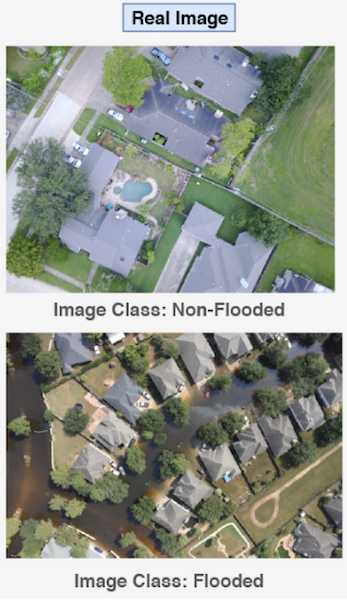
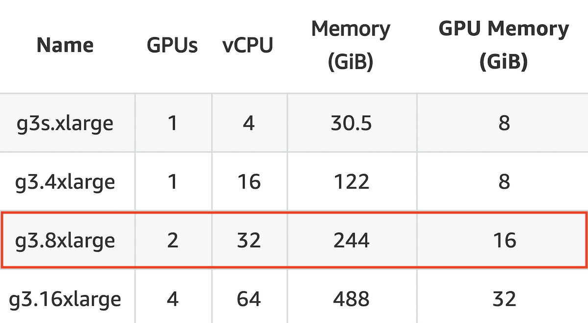

**Codebase:** [https://github.com/msbutler/cs205final](https://github.com/msbutler/cs205final)

# Problem Statement
Climate change has brought about increasingly frequent natural disasters, including flooding, thereby threatening human lives and infrastructure amongst others. Access to accurate and identifiable visual data is extremely instrumental for a directed and efficient relief response. The proliferation of unmanned aerial systems (UAS) with inexpensive sensors has led to a host of high resolution images but the main challenge of analysing these images on a high-frequency and real-time basis with high accuracy still stands. 

Therefore, our project aims to construct and train a deep image classifier system that identifies flooded regions from these UAS images. This project requires big compute due to protracted training time required for complex deep Convolutional Neural Networks (CNNs), as well as the need for more iterations without using a pre-trained model. Big data techniques are also employed to more effectively manage numerous large high-definition images. Hence, we deploy the model for fast, highly parallelizable classification on Amazon Web Services (AWS).

# Existing Work
Several studies in recent years have explored image classification for disaster relief. Gebrehiwot et al. (2019) developed a deep CNN for flood mapping based on UAV data (similar to our dataset).[[1]](#1) Gebrehiwot reported that it took about 26 hours for cross validation using a single GPU (NVIDIA Quadro M4000). Sarker et al. (2019) developed a supervised CNN for flood mapping based on satellite images.[[2]](#2) They used a High Performance Computing (HPC) server to train their model rather than a GPU and reported a training time of 24 hours. A more recent study, Hashemi-Beni and Gebrehiwot (2021), also developed a CNN for flood labeling of images, but did not report the infrastructure used for training the model or the required training time.[[3]](#3)

Instead of a fully-supervised approach as with the studies described above, we focused on building a semi-supervised model because real-world datasets are predominantly unlabelled. Our semi-supervised model is a convolutional neural network (CNN) that learns from both labeled and unlabeled images, therefore requiring a custom loss function and various data augmentations for implementation. Instead of transferring and applying a pre-trained model, we built our CNN from scratch, adapting and simplifying key components from Google's MixMatch and FixMatch algorithms.[[4]](#4)[[5]](#5) We elaborate on the specifics of our algorithm in the following section.

Additionally, it is worth noting that this work can be easily extended to other natural disasters like wildfires and debris from earthquakes. We hope this work contributes to the increasingly numerous humanitarian applications of machine learning with big compute and big data.

# Model and Data
## Model
We developed a custom semi-supervised CNN for image classification. The architecture used first consists of 3 convolutional layers with ReLU activation function, batch normalization and max-pooling. The first convolutional layer has a 25 by 25 kernel size and stride length of 10, which is intentionally made relatively larger than the following layers in order to capture broader trends and patterns of the original image. The second and third convolutional layers have a 5 by 5 kernel size and stride length of 2. All convolutional layers have a max-pooling kernel size of 2 by 2 and batch normalization is employed in each layer to tackle the issue of internal covariate shift when the distribution of each layer's inputs changes during training due to back-propagated parameter updates. Thereafter, the output of the third convolutional layer is flattened and passed to a fully connected layer with an intermediate output size of 64 before a ReLU activation function. Finally, the last layer is another fully connected layer with the final output size of 1 before a Sigmoid activation function, pushing the classification to be boolean corresponding to either a non-flooded or flooded image. This architecture is illustrated in **Figure 1** below.

**Figure 1: CNN Architecture**

During training, we use the architecture described above to classify both labeled and unlabeled images as flooded (1) or nonflooded (0). For labeled images, we want the model to produce predictions that match the ground-truth labels, so we penalize the loss function when predictions do not match the true labels. With unlabeled images, we want the model to assign photos with similar features to the same class. Therefore, we augment each unlabeled image several times and penalize the model for producing different predictions across augmentations of the same image. Augmentations may include rotations, translations, reflections, or noise additions to the original photos. For consistency between the labeled and unlabeled training data, a single augmented version of each labeled photo is used in lieu of the original image.  

The training process for a single mini-batch within an epoch is illustrated in **Figure 2**. We perform a forward pass on the augmented version of each labeled photo and the _k_ augmentations of each unlabeled photo within the batch. For the unlabeled images, a "guess" at the true label is produced by taking the mean of the model predictions for the _k_ augmentations of the same image. Model predictions are then evaluated using cross entropy with the true label (for the labeled data) or the L_2 loss with the guess label (for the unlabeled data). Total loss for the batch is the sum of the labeled loss with the unlabeled loss, where the unlabeled loss is weighted by a constant.

For training, we use the Adam optimizer with a learning rate of 0.001 and 500 epochs.

**Figure 2: Outline of Model Training for One Batch/Epoch**

## Data
The dataset used comes from the Floodnet Challenge [[6]](#6), with approximately 2,300 quadcopter or drone images of land from post-Hurricane Harvey. The data is segmented into 60% training, 20% validation and 20% testing sets. Of the training set, 25% is labeled (approximately 400 out of 1,400 images). Examples of a non-flooded and flooded image are shown in **Figure 3**. These images are of high resolution, 3000 by 4000 pixels, and hence are reduced to 750 by 1000 pixels for more efficient training and memory management.

**Figure 3: Example Images for Classification** 

Our data set consists of 51 labelled flooded images, 347 labelled unflooded images, and 398 unlabelled data images. We used 80% from each subset for training.

# Parallel Application, Programming Models, Platform and Infrastructure
Training convolutional neural networks is highly computationally intensive due to the many intermediate calculations required at each point of the architecture. In our situation, this issue is exacerbated by the high quality resolution of our images, which inherently increases the problem size at every intermediate step. Fortunately, matrix multiplication, convolutions, and pooling are all highly parallelizable tasks, and for this reason we relied on accelerated computing with a GPU to speed up the training and evaluation process for our model. This constitutes procedure-level parallelization as we are parallelizing regions of code within a task and thus falls in the external, fine-grained domain of Big Compute.

We evaluate performance by training our model on an AWS GPU. Specifically, we use a g3.8xlarge instance with Ubuntu 18.04 and the AWS Deep Learning AMI which pre-configures commonly used machine learning packages into different virtual environments. **Table 1** includes additional details about the configuration. Python (specifically `Tensorflow`) encodes our CNN and controls the hardware. Certain operations in `Tensorflow` (i.e., Matmul for matrix multiplication) include both CPU and a GPU implmentations "under the hood". If running code on a GPU, `Tensorflow` automatically prioritizes the GPU implementation of the operation. We control the number of GPUs visible to CUDA (and therefore, `Tensorflow`) by setting the enviornment variable `CUDA_VISIBLE_DEVICES` to the desired GPU IDs using the `os` package.

**Table 1: GPU Configuration Details** 

 Note: AWS unfortunately did not grant us a limit increase needed to use the next largest g3 instance with four GPUs (we reached out again and still have not heard back from their support). 

We have also initially experimented with storing all the images on a AWS S3 bucket but transitioned to downsizing the image resolution and storing it on GitHub due to GPU memory optimization as will be discussed in later sections.

# Software Design
**Codebase:** [https://github.com/msbutler/cs205final](https://github.com/msbutler/cs205final)

As mentioned above, our model is built in Python primarily using `tensorflow`. We also rely on the `os` package for reading in data; `skimage`, `random`, and `PIL` for image analysis; `numpy` for additional data analysis; and `matplotlib` for plotting our results. Each of these packages comes pre-installed with the AWS Deep Learning AMI. Replication information for producing the same environment with the same package versions used in our tests is included in the `Replication.md` instructions file on the Github (see Codebase link above).  **Table 2** also includes version information.

**Table 2: Software Package Version Information** 
[INSERT TABLE 2: version info for packages]

Our code is structured as follows:
- `Train/`:  folder with subdirectories for labeled and unlabeled training data
- `Figures/`:  folder containing results from performance tests
- `architecture.py`:  defines CNN architecture
- `config.py`:  configures data parameters (i.e., image resize dimensions)
- `performance.py`:  script for running weak and strong performance tests (outlined in the next section)
- `run.py`:  trains one instance of the supervised or semisupervised model
- `semisupervised.py`:  specifies training methodology for the semisupervised model
- `supervised.py`:  specifies training methodology for the fully supervised model
- `utils.py`:  contains functions for image analysis and developing training/testing sets

MOVE NOTEBOOKS
ADD COMMENT ON TABLE 1
ADD COMMENT ABOUT DIFFERENT SCALING IN PERFORMANCE EVAL FOR SEMISUPERVISED DUE TO MEMORY ISSUES

# Performance Evaluation
We have conducted 2 broad tests to evaluate both weak and strong scaling for our deep classifier. Firstly, weak scaling is tested by increasing the training and testing data as a proxy of the problem increasing proportionally to the number of processors or processing power. Using a g3.8xlarge instance with 2 GPUs, both supervised and semi-supervised versions of the classifier are trained over 5 iterations to generate average training times for 25%, 50%, 75% and 100% of the dataset (both labeled and unlabeled). Secondly, strong scaling is tested by training the algorithm on the full dataset and varying the number of GPUs used on a g3.8xlarge instance by having Tensorflow interface with CUDA, setting CUDA_VISIBLE_DEVICES to different lists of GPU devices as mentioned in earlier sections. Computational times from strong scaling experiments will indicate the speedup of increasing number of processors while fixing the problem size.

Several optimizations were conducted for the parallelization process, including reducing the image resolution size and varying the optimal batch size to fit within the GPU memory as training on the original high-definition images led to various memory issues on the GPU. Nevertheless, there are numerous overheads when training on the GPU and hence, the theoretical speed-up or perfect scaling where computational time decreases linearly with lower training data or generally decreases with more GPUs is not expected. The main overhead for GPU-accelerated computing is the data transfer between the CPU and GPU, where most matrix multiplications and convolutions are conducted within the GPUs. Moreover, it is noteworthy that GPU acceleration is most effective for data parallelization which is suitable in our implementation of weak scaling but is not optimal for speeding up more complex or deeper neural network architectures.

# Discussion
goals achieved, improvements suggested, lessons learnt, future work, interesting insights

future work: Use Tensorboard for GPU analysis...

semisupervised weak scaling for [0.1,0.2,0.3,0.5] % of total dataset: 
Weak Scaling Times: [6.167605590820313, 18.977311420440675, 40.378678464889525, 100.61357822418213]

# Citations
<a id="1">[1]</a> 
Asmamaw Gebrehiwot et al. "Deep convolutional neural network for flood extent mappingusing unmanned aerial vehicles data". In: _Sensors_ 19.7 (2019), p. 1486.

<a id="2">[2]</a> 
Chandrama Sarker et al. "Flood Mapping with Convolutional Neural Networks Using Spatio-Contextual Pixel Information". In: _Remote Sens._ 11, 2331 (2019).

<a id="3">[3]</a> 
Leila Hashemi-Beni & Asmamaw Gebrehiwot. "Flood Extent Mapping: An Integrated Method Using Deep Learning and Region Growing Using UAV Optical Data". In: _IEEE Journal of Selected Topics in Applied Earth Observations and Remote Sensing_ 14 (2021), p. 2127-2135.

<a id="4">[4]</a> 
David Berthelot et al. "Mixmatch: A holistic approach to semi-supervised learning". In: _arXivpreprint arXiv:1905.02249_ (2019).

<a id="5">[5]</a> 
Kihyuk Sohn et al. "Fixmatch: Simplifying semi-supervised learning with consistency andconfidence". In: _arXiv preprint arXiv:2001.07685_ (2020).

<a id="6">[6]</a> 
_IEEE Earth Vision 2021 Floodnet Challenge_. [http://www.classic.grss- ieee.org/earthvision2021/challenge.html](http://www.classic.grss- ieee.org/earthvision2021/challenge.html). Accessed: 2021-04-01.
